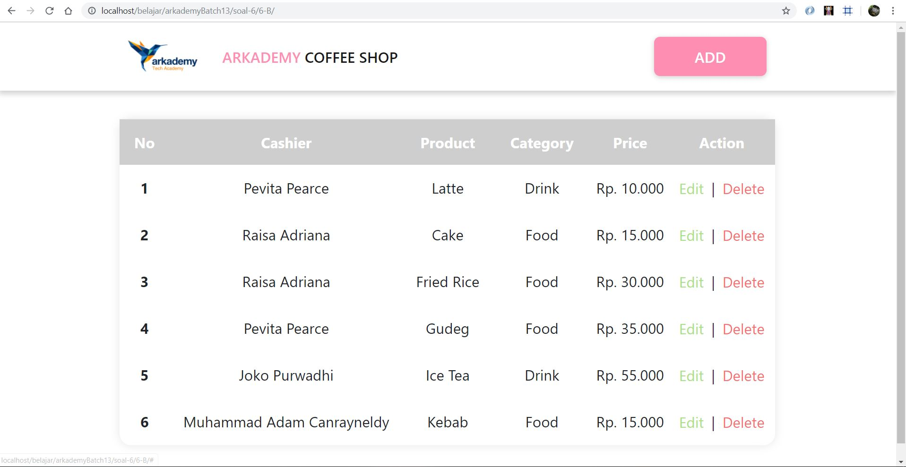
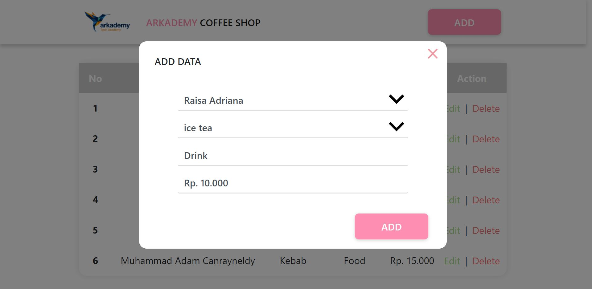
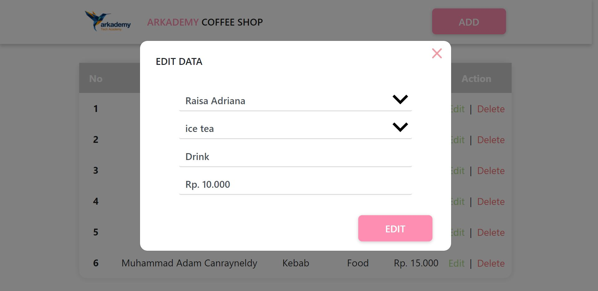
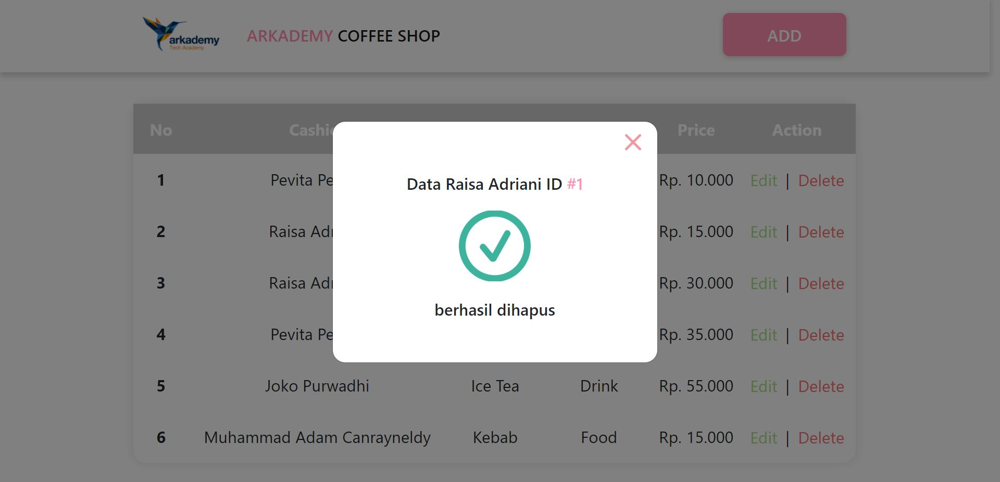

## Arkademy Batch 13 - 2
#### jawaban dari tes yang diberikan oleh Arkademy

### Soal 1(1.js)
cara menjalakan program:
* jalankan pada console di browser anda
* atau salin code-nya lalu jalankan(run) diconsole pada website berikut: [es6console.com](https://es6console.com/)

Fungsi JSON pada REST API adalah sebagai tipe dari sebuah data yang diberikan/dikembalikan oleh REST SERVER. dengan tipe JSON maka akan memudahkan kita untuk mengakses data tersebut.

### Soal 2(2.js)
cara menjalakan program:
* jalankan pada console di browser anda
* atau salin code-nya lalu jalankan(run) diconsole pada website berikut: [es6console.com](https://es6console.com/)

pada fungsi/method ```validationForm('adamc','11@ADAM')``` - parameter pertama username dan parameter kedua password.

### Soal 3(3.js)
cara menjalakan program:
* jalankan pada console di browser anda
* atau salin code-nya lalu jalankan(run) diconsole pada website berikut: [es6console.com](https://es6console.com/)

function ```randomize()``` - menerima sebuah parameter berupa **number**, ketika paramter yang diterima bukan **number** maka function me-return **false**. tetapi jika parameter berupa **number** function mengembalikan array yang panjangnya sesuai dengan argument yang diberikan, isi array berupa angka random. lalu function ini menjumlahkan isi array-nya.
contoh: ```randomize(6)``` - Output-nya = ```array : [1,3,4,2,3,2] sum : 15```

### Soal 4(4.js)
cara menjalakan program:
* jalankan pada console di browser anda
* atau salin code-nya lalu jalankan(run) diconsole pada website berikut: [es6console.com](https://es6console.com/)

fungsi ```findSame()``` menerima sebuah parameter berupa **array**(yang berisi lebih dari satu string). jika parameter **bukan array** fungsi tersebut langsung me-return **false**. tetapi jika parameter yang diterima **adalah array** maka fungsi ini akan mengecek string-string yang ada didalam array tersebut dimana pengecekan itu dimaksutkan untuk mencari dan mengumpulkan string yang **memiliki panjang yang sama** dan **character yang sesuai**(biasa disebut Anagram), lalu me-return **hasil string yang anagram**.

### Soal 5(5.js)
cara menjalakan program:
* jalankan pada console di browser anda
* atau salin code-nya lalu jalankan(run) diconsole pada website berikut: [es6console.com](https://es6console.com/)

fungsi ```ganti_kata()``` pada **5.js** memiliki tugas untuk mengganti **huruf(character)** pada **kata/kalimat** dengan **huruf(character)** baru, contoh: **"purwakarta"** menjadi **"purwokorto"**. fungsi menerima tiga buah parameter(**String**). parameter pertama berupa **kata/kalimat**, parameter kedua adalah **character/huruf** pada parameter pertama yang ingin diganti(contoh: 'a'), dan parameter ketiga sebagai **huruf pengganti**(contoh: 'o').

### Soal 6(6.js)

yang harus disiapkan untuk menjalankan soal 6:
* Install Web Server(Xampp,Lamp,Mamp, dll) karena soal-6 membutuhkan web server dan database server.
* disini menggunakan **Xampp**
* clone/download repository **ArkademyBatch13-2** simpan di direktori Web Server, contoh: **xampp (C:/xampp/htdocs/)**

**Soal 6-A** <br/>
pada folder 6-A terdapat file **arkademy_batch_13_2.sql** dan **Query.txt** untuk memunculkan tabel seperti perintah di soal 6-A dari hasil query.

cara menjalankan soal 6-A:
* buka aplikasi XAMPP
* arahkan browser ke url **localhost/phpmyadmin**
* lalu buat database dengan nama **arkademy_batch_13_2**
* pilih database tersebut
* setelah itu pergi ke menu **Import**
* klik **pilih file**, lalu arahkan ke file **arkademy_batch_13_2.sql** pada folder **6-A/**
* jika sudah klik **go**
* maka database tadi sudah berisi tabel yang diimport tadi
* setelah itu masuk ke database tersebut dan klik menu **SQL**
* dan paste-kan **Query** yang ada pada file **Query.txt**
* lalu klik **go**, maka tampilannya akan sesuai dengan yang diminta oleh soal
<br/>

**Soal 6-B** <br/>
cara menjalankan soal 6-B:
* hanya jalankan **index.html** pada browser
* karena masih menggunakan data statis

Tampilan utama:

<br/>
<br/>
Tampilan ketika button **ADD** ditekan:

<br/>
<br/>
Tampilan ketika button **Edit** ditekan:

<br/>
<br/>
Tampilan ketika button **Delete** ditekan:

<br/>

**Soal 6-C** <br/>
Baru sampai Read data(Create,Update,Delete belum). belum selesai.